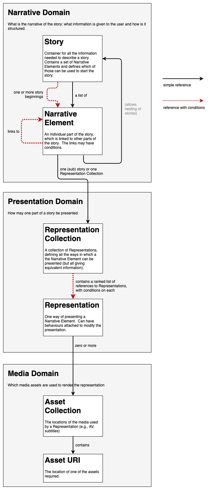
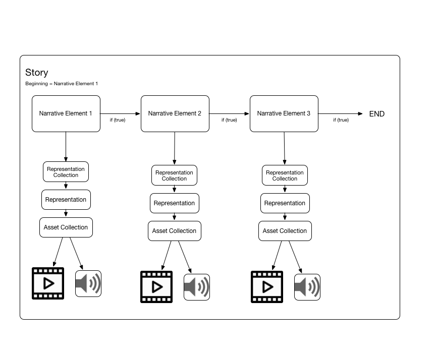
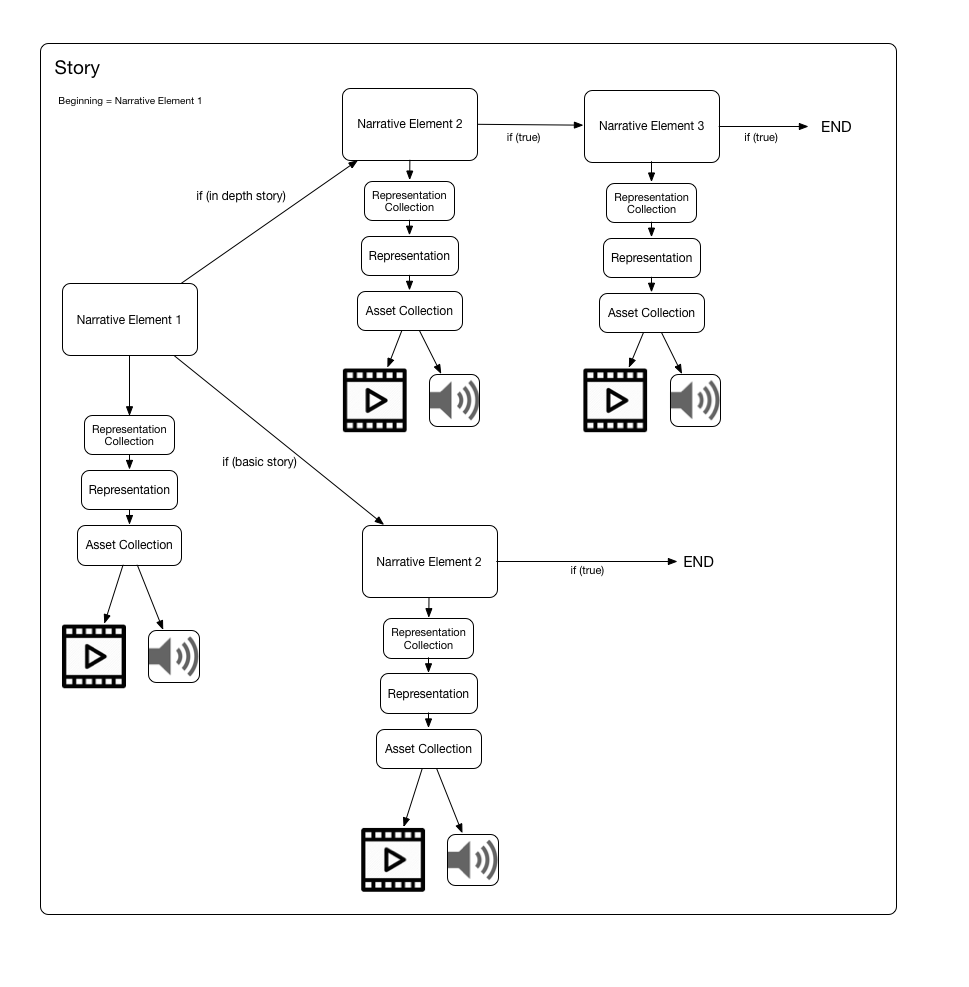
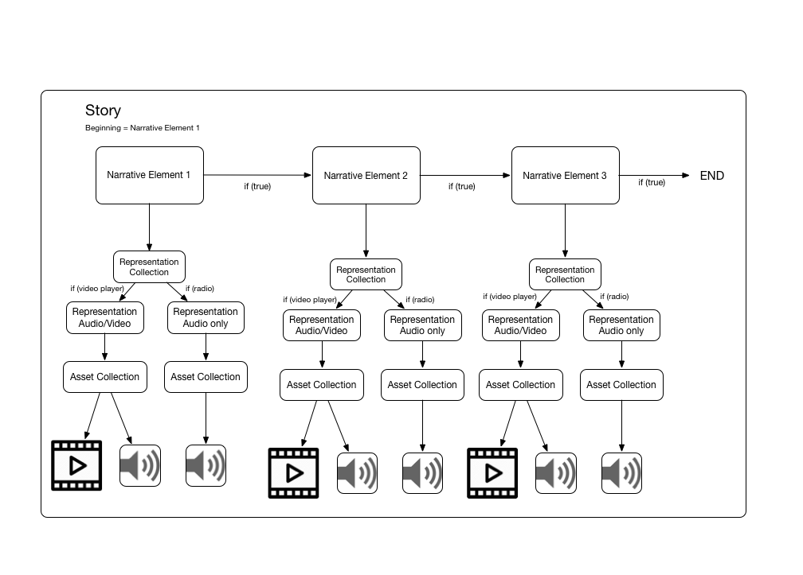
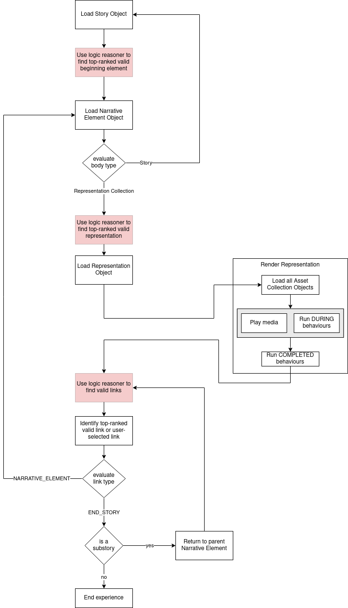

# Object Based Media Schema Overview

The data model described in these schema has been built with the intention of flexibly representing simple linear stories and potentially complex narratives with any number of possible branches and target playback devices. One of the essential concepts embodied in this data model is that the media itself is only associated with the individual elements of the story at the final layer, allowing multiple device or user-centric decisions to affect which eventual piece of media should be played to represent a particular part of the story.



As can be seen from this diagram, the data model covers a number of domains and attempts to keep a clean separation of concerns between these. At the top level is the narrative domain, which is used to describe the structure of stories.  Next is the presentation domain which is concerned with how the components of a story are presented to the audience.  Below this is the media domain - the assets used ro render the story.  Also included in the model, but not shown in the diagram, is the production domain, which is concerned with integrating an outline story model and populating it with media.  Below is a brief overview of each of these domains.

## The Narrative domain
The highest level object in our data model is the ```story```. The ```story``` object holds metadata such as a name and description of the story, and the ```narrative_elements``` that make up the story. It maintains a list of ```beginnings``` that inform the player of all the possible ```narrative_element```s that are available to start the story.

The data model is based upon the assumption that any given ```story``` can be broken down into a number of discrete ```narrative_element```s that represent the smallest divisible chunks of a ```story```. These could be 'scenes' in a drama, actions or steps in an educational programme (such as a cookery or how-to program) or sections or threads of a documentary.

To give a simple example, a traditional linear production would contain one ```beginning``` of a single ```narrative_element``` and the ```narrative_element```s would be linked together, one after the other and play sequentially, with each ```narrative_element``` referencing one piece of media.


Each ```narrative_element``` contains a series of ```links```, which point to another ```narrative_element``` in the ```story```. Stored against these ```links```, is a conditional, which when evaluated determine whether that path should be chosen.

The ```body``` of a ```narrative_element``` points towards its content, and can make reference to either a ```representation_collection``` object or a ```story``` object.  The latter is a way of nesting stories so that when a narrative element is visted, the whole of the story it contains is played out.  The former is the simpler case, and the ```representation_collection``` object will point to one or more ways of telling this individual chunk of story.

## The Presentation domain

The ```representation_collection``` object is a container for all the potential ```representation```s of the ```narrative_element```. The purpose of these ```representation```s is to allow the creator of the story to simultaneously target multiple playback platforms or types of audience, and store these under the same logical section of story. You might want a ```representation``` for video, audio-only or text, allowing the story to be played back on different types of devices. You could also use ```representation```s to target different audiences, for example, a pre-watershed profanity-filtered version and an adult version. Multiple ```representation```s could also be used for different language tracks.  Although this schema does not enforce, or even describe, how representations are used, the philosophy behind them is that they are different ways of telling the same piece of narrative.

```representations``` are of a predetermined type, defined in this schema. This allows us to narrow the scope of the plethora of potential combinations of audio, video, text and image, and allows us to create simpler players. Currently, these types allow us to describe, simple audio/video, 360 audio/video, audio-only, text, image and image with audio.  There is another special ```representation``` type: ```switchable```.
```switchable```s allow multiple representations to be grouped together that are designed to be played concurrently such as multiple camera angles. A switchable contains a ```choices``` field that allows the referencing of these additional representations.   Representations can have ```behaviours``` associated with them.  These are ways of modifying the way in which the```representation``` behaves (e.g., to pause at the end and wait for user input, or to present the user with a set of choices) without the need for a different representation type for each combination.

A ```representation``` points to one or many ```asset_collection```(s) depending on the ```representation```s type. ```asset_collection```s are nothing more than a container to bundle together identifiers for media. In our implementation, these identifiers map to [NMOS](https://github.com/AMWA-TV/nmos) packages or published media urls.

## The Production domain

In addition to the ```story``` model there is a ```production``` model which aids with producing the story. At the top of this model is a ```production``` object which has a 1:1 mapping with a ```story```. The ```production``` holds the ```scene``` and ```shooting_schedule``` objects and some of the ```production_package```s. As a result the ```production``` object holds (or holds links to) everything related to production of a particular story.

The ```scene``` object usually maps 1:1 with a ```representation```. In the case where the ```scene``` is linked then it acts as a container for all production data related to that particular ```representation```. When no link exists then the ```scene``` acts as a container for captured content that isn’t linked to any specific ```narrative_element``` or ```representation```. The ```scene``` object links to ```shot``` objects and ```rush``` objects.

```shot```s contain information about what is to be shot and ```rush```s contain links to the actual captured content via objects called ```production_package```s.

A ```production_package``` is a wrapper around a piece of content that holds extra metadata in the form of annotations. These annotations are captured during and after a shoot and can describe different aspects about the content. As the annotations are timestamped precise information about what happened in the content at a certain time can be logged.

Finally a ```shooting_schedule``` holds information about what needs to be captured and when it has been scheduled to be captured. After capture this object is updated with actual timings rather then the original predicted timings.

# Examples

Below are three simple example stories built using this data model. These should illustrate some of the concepts described above.

## Simple linear story
This is how a traditional linear audio/video composition might look. Multiple narrative elements, each with one representation, which all resolve down to a piece of audio and video. Each narrative element will play its material before unconditionally moving to the next element and ending after the last piece of video has been played.




## Simple branching story
One use of branching might be to describe the same basic story with different amounts of detail. Here, a simple branching story is shown with each narrative element again resolving to a single piece of audio and video. The conditionals on the links in the first narrative element will determine which link is followed based on a global environment variable determining if a 'basic' story or an 'in depth' story should be played back.



## Simple multi-representation story
This is what a multi-platform, linear story might look like. Each narrative element follows the next in the same way the basic story does, but depending on if the player is a video player or radio, different media will be selected to represent that part of the story.



# OBM Data Model in Detail

The details of the objects in the schema are below.  Each object has a required ```object_class``` attribute; this is given below.  In addition Objects are identified using a required `id` field using a UUID string, and the version of this schema that the Object was created against is recorded in the ```schema_version``` attribute.  Many objects may have ```meta``` and  ```tags``` attributes: see [Meta](#`Meta`-Field) and [Tags](#`Tags`-Field), below.  If a non-required attribute is present, it must take the correct form, although often an empty String (```""```), Array (```[]```) or Object (```{}```) is valid.

## Story

The Story Object is the top-level object. It either represents a whole standalone experience, or a smaller experience which is referenced in another story. It can be extended with other attributes. Stories are the logical containers for Narrative Elements, the 'atoms' of Stories.

The Story contains a list of possible ```beginnings```, which store ```narrative_element``` IDs against a  conditional to decide which ```narrative_element``` should be chosen to start the story based on variables set in the player environment.

### Attributes:
* ```id``` 				    (String: UUID)
* ```object_class```        (String: "```STORY```")
* ```name``` 				(String: Free Text)
* ```version``` 			(String: PTP timestamp) - time of last update to story
* ```description```         (String: Free Text)
* ```tags``` 				(Object: See [Tags](#`Tags`-Field))
* ```variables```           (Object: required), see below for details
* ```beginnings```			(Array of Objects, required), see below for details
* ```narrative_element_ids``` 	(Array of UUID strings, required) - IDs of narrative elements contained within this story
* ```meta``` 				(Object: See [Meta](#`Meta`-Field))


#### variables
The ```variables``` attribute defines the variables that can be used in the logic of the story.  They are stored as Objects in a dictionary.  This may be an empty Object.  The key for each ```variable``` is its name and the Object contains the following attributes:

* ```variable_type```       (String, required) - defines the type of variable.  One of
    - ```boolean``` -  a variable that can take the value true or false
    - ```list``` - a variable that can take one of a defined set of values (each represented by a String)
    - ```number``` - a variable that takes the value of a number within a range
    - ```string``` - a variable that can take the value of any String
* ```default_value```       (String, required) - the default value for the variable; type depends on  the ```variable_type```
* ```description```         (String: free text)
* ```range```               (Object, required for ```number``` variables)
    - ```min_val``` (Number) - the minimum value the variable can take
    - ```max_val``` (Number) - the maximum value the variable can take
* ```values```              (Array of strings, required for ```list``` variables)

#### beginnings
The ```beginnings``` attribute defines a set of narrative elements that can start the story, and the conditions under which each is valid.  The array is ordered such that the first beginning whose condition evaluates to ```true``` will be used to start the story.

* ```id``` 				    (String: UUID) - ID of the beginning
* ```narrative_element_id``` - (String: UUID) - ID of the narrative element its pointing to
* ```condition``` - (Object: [JsonLogic](http://jsonlogic.com/) conditional) - This is evaluated to determine if the beginning can be followed.

### Example:
[Story example](../samples/sample.story.json)


## Narrative Element
The Narrative Elements are the basic building blocks of our story. They control the flow of a story with the conditionals on their links to other Narrative Elements and the content with links that eventually resolve to playable media or other stories. In future it will support additional metadata to describe the semantics of the narrative, but for now, it only supports simple graph-based navigation.

### Attributes

* ```id``` 				    (String: UUID)
* ```object_class```        (String: "```NARRATIVE_ELEMENT```")
* ```name``` 				(String: Free Text)
* ```version``` 			(String: PTP timestamp) - time of last update to story
* ```description```         (String: Free Text)
* ```body```                (Object, required) - Contains either a link to another ```story``` or a ```representation_collection```
* ```links```               (Array of Objects, required), see below for details
* ```tags``` 				(Object: See [Tags](#`Tags`-Field))
* ```meta``` 				(Object: See [Meta](#`Meta`-Field))

#### body
The ```body``` attribute points to the content of the element - where the representations for that part of the story are held.  The "normal" situation is for this to point to a collection of representations, but the alternative is to nest an entire story, in which case the pointer is directed at a ```story``` object.

* ```type```              (String, required) - One of either:
  - "```REPRESENTATION_COLLECTION_ELEMENT```" if the link points to another ```narrative_element``` with the same story
  - "```STORY_ELEMENT```" if the link points to a ```story``` 
* ```target```            (String: UUID, required) UUID of story or narrative_element


#### links

The ```links``` attribute is an ordered array of Objects which determine where the story goes after this element is complete.  The first link whose condition evaluates to ```true``` is the one followed.  If no links are valid, then this story ends.

* ```target_narrative_element_id``` (String: UUID) - required for links pointing to ```narrative_elements```
* ```description``` - (String) Free text description
* ```condition```         (Object: [JsonLogic](http://jsonlogic.com/) conditional) - When evaluated determines if the link should be followed)
* ```link_type```         (String, required) - One of:
  - "```NARRATIVE_ELEMENT```": A link to another ```narrative_element```. Most links will probably be of this type.
  - "```CHOOSE_BEGINNING```": Denotes the end of the current branch and prompts the player to go back to the list of ```beginnings``` held against the story object and choose a new one.
  - "```END_STORY```": Prompt the player to cease playing the current ```story```.

### Example
[Narrative Element example](../samples/sample.narrative_element.json)


## Representation Collection

The ```representation_collection```  deals with how an individual part of the story is presented to the user. It consists of multiple representations which are different "views" on the same narrative content (alternative narrative flows, such as a “more experienced” or “less experienced” flow are best captured in the narrative).

### Attributes:

* ```id``` 				(String: UUID)
* ```object_class```        (String: "```REPRESENTATION_COLLECTION```")
* ```name``` 				(String: Free Text)
* ```version``` 			(String: PTP timestamp) - time of last update to representation_collection element
* ```representations``` (Array: Array of Objects), see below for details
* ```tags``` 				(Object: See [Tags](#`Tags`-Field))

#### representations
The ```representations``` attribute holds an array of Objects that determine which ```representation``` is used to present this part of the story.  Each Object containing a target id held against a JsonLogic condition).  The Array is ordered, such that the first ```representation``` whose condition evaluates to ```true``` will be presented.

* ```representation_id``` (Object) - Object with one key, ```id```, which is the id of the representation to use should the conditional evaluate to true.
* ```condition``` (Object: [JsonLogic](http://jsonlogic.com/) conditional) - When evaluated determines if the representation should be played.

### Example

[Representation Collection  example](../samples/sample.representation_collection.json)

## Representation

Representations are used to store different formats of a particular story, suitable for different playback devices. You may have one representation for video, one for VR, one for audio-only and one for text. Each representation would tell the same story, just formatted for a different presentation environment. This isn't about bitrates, codecs or resolutions. It's all about fundamentally different ways to tell the same story.


### Attributes:
* ```id``` 				(String: UUID) 
* ```object_class```        (String: "```REPRESENTATION```")
* ```name``` 				(String: Free Text)
* ```version``` 			(String: PTP timestamp) - time of last update to representation
* ```representation_type``` (String, URN), see below for details
* ```asset_collections```   (Object), see below for details
* ```choices```             (Array of Objects), see below for details
* ```behaviours```          (Object), see below for details
* ```duration```            (number)  Specifies how long the representation is presented to the user before automatically completing; a negative value is interpreted as completion only happening when triggered by the user.  If this attribute is present but not used (e.g., `simple-av` type, a value of `null` value may be given.
* ```tags``` 				(Object: See [Tags](#`Tags`-Field))
* ```meta``` 				(Object: See [Meta](#`Meta`-Field))

### representation_type
A representation type is used by the player to determine what media playback module to load to realise this particular representation. The following representations have been defined which contain their type-specific attributes denoted below.  URNs are the `type` prefixed with `urn:x-object-based-media:representation-types:` and suffixed with the version number, e.g., `urn:x-object-based-media:representation-types:simple-av/v1.0`

| type | version | description | required fields |
|---|---|---|--|
| `simple-av` | `1.0` | This is a basic piece of muxed video content. |  |
| `simple-audio` | `1.0` | Audio content.  An optional `background_image` attribute in `asset_collections` may be used to tell the player to display an image during the representation.
| `image`| `1.0` | A simple image that is shown for a specified period of time. | `duration` |
| `immersive` | `1.0` | This is a 360 piece of muxed video content. | |
| `image360` | `1.0` | A 360 image | `duration` |
| `switchable` | `1.0` | A special representation type that can nest other representations that are intended to be played simultaneously. `switchable` is intended to be used when multi-camera playback is desired, allowing the viewer to switch between multiple representations. | `choices` |

### asset_collections
The `asset_collections` field contains an Object whose attributes will depend on the type of representation denoted in the `representation_type` field.

* ```foreground_id```       (String: UUID, required) - id of an ```asset_collection``` that is the primary content (depending on the type, e.g., an ```IMAGE``` asset_collection for an ```image``` representation)
* ```background_ids```      (Array of UUID Strings) - ids of ```asset_collection```s of background media, e.g., ```SIMPLE_AUDIO``` assets that accompany the primary presentation.
* ```background_image```      (String: UUID) - optional pointer to an ```asset_collection``` for `simple_audio` representations; if present this image will be displayed by the player application while the audio is playing
* ```icon```                (Object) - pointers to ```asset_collection```s, used in chapter navigation menus that might be surfaced by the player application.  This Object contains two attributes:
    - `default_id`  (String: UUID, required) - an icon to be displayed to represent this representation in chapter navigation.
    - `active_id`: (String: UUID) - an icon to be displayed to represent this representation when it is currently playing.
* ```behaviours```          (Array of Objects) - references assets used by any behaviours associated with this ```representation```.  Each Object contains two attributes:
    - `behaviour_asset_collection_mapping_id`   (String: UUID, required) - a UUID that is referred to in the behaviour definition.
    - `asset_collection_id`     (String: UUID, required) - the UUID of the ```asset_collection``` that points to the media used.

For example:
```
 "asset_collection": {
        "foreground": "5b279dc2-6106-42e6-ae67-c4bf363916de",
        "background": [
            "d22484f9-da14-484b-8051-71be36b2227f"
        ],
        "icon": {
            "default": "98c952fa-db21-41f9-ab22-9c16ba61fd58"
            "active": "0ed9bde9-4f05-4340-8c76-8725f39de368"
        }
    }
 ```

### choices
Used only in conjunction with the ```switchable``` ```representation_type```, this field defines which representations the user can switch between.

-   ```choice_representation_id``` (String: UUID, required) id of representation this choice is pointing to
-   ```id``` (String: UUID) - identifier of this choice Object
-   ```label``` (String) - label to be surfaced in the play back client (e.g., 'camera 1')


### behaviours

Representations can also exhibit `behaviours`. Behaviours are set pieces of rendering behaviour that aid in the construction of the story you're trying to present. These could be things like mandating a pause after a particular element has been played or ensuring a time delay is observed before playing an element.  `behaviours` is an Object with up to 3 Objects inside:

* ```STARTED```: (List: of objects) with a `type` attribute denoting behaviour type in URN form and any other attributes needed to specify the exact behaviour.
* ```COMPLETED```: (List: of objects) with a `type` attribute denoting behaviour type in URN form and any other attributes needed to specify the exact behaviour.
* ```DURING```: (List: of objects) with a `behaviour` attribute denoting behaviour type in URN form and any other attributes needed to specify the exact behaviour, a `start_time` attribute that defines the time into the media, in seconds, that the behaviour takes effect, and an optional `duration` attribute that defines when it completes.

A simple example `behaviours` attribute would be the following, with two behaviours run as the representation starts, to pause the media for 3 seconds, and apply a blur to the content for that time:

 ```
    "behaviours": {
        "STARTED": [
            {
                "type": "urn:x-object-based-media:asset-mixin:pause/v1.0",
                "pauseTime": 3.0
            },
            {
                "type": "urn:x-object-based-media:asset-mixin:blur/v1.0",
                "blur": 3.0
            }
        ]
    }
 ```
 The above denotes that the playback engine should pause for 1 second before before playing back this representation.

#### Behaviour types

The `type` attribute is given as the URN below prefixed with: `urn:x-object-based-media:representation-behaviour:`

| Name | URN | Description | Attributes | Notes |
| -- | -- | -- | -- | -- |
| Pause | `pause/v1.0` | Pause the progress of the story, e.g. on completing the representation, pause for a set time. | `time` (unsigned float between -1 and 9007199254740991) | Time, in seconds, to pause for.  A negative time implies wait for user to move |
| Colour overlay | `colouroverlay/v1.0` | Overlay a colour on the media during the pause | `colour` (string, css style rgba values - eg `"rgba(0, 0, 0, 0.7)"`) | Requires `pause` behaviour |
| Image overlay | `showimage/v1.0` | Overlay an image on the media during the pause | `image` (string, `behaviour_asset_collection_mapping_id` UUID of an asset collection in the `asset_collections` attribute) | Requires `pause` behaviour |
| Blur | `blur/v1.0` | Blur the media during a pause | `blur` (unsigned float, blur amount) | Requires `pause` behaviour.  Value is applied as CSS blur. |
| Exit Full Screen | `exit-fullscreen/v1.0` | Exit the player from Fullscreen mode | (no attributes) | Most likely to be used as a COMPLETED behaviour for an ending element. |
| Modify variable | `manipulatevariable/v1.0` | Apply a JSONLogic operation on a variable in the story | `target_variable` - the name of the variable; `operation` - a JSON logic expression | See the [Representation example](../samples/sample.representation.json) for an example that increments the `counter` variable by 1 |
| Social Media Sharing | `socialmodal/v1.0` | Display some share links for social media over the media | See below for details ||
| Link out of experience | `linkoutmodal/v1.0` | Display some text with a link out of the experience | See below for details ||
| Text overlay | `textoverlay/v1.0` | Display some text over the content | See below for details ||
| Link choices | `showlinkchoices/v1.0` | Display text or icons to allow the user to choose between valid links. | See below for details | Only those links from this representation whose conditions evaluate to `true` will be presented. |
| Show variable panel | `showvariablepanel/v1.0` | Display an interface to allow users to set the values of one or more story variables | See below for details ||
| Link Map Overlay | `mapoverlay/v1.0` | Places an invisible set of clickable rectangles on the screen (e.g., over an image or video) that can be used to navigate to Narrative Elements. | See below for details | This behaviour overrides the concepts of links, so link conditions are not evaluated. |
| Fade in | `fadein/v1.0` | Apply a colour overlay, fading in over a given duration | `colour` (string, css colour) and `duration` (number, time in s) | Typically applied as a during behaviour with `start_time` 0 |
| Fade out | `fadeout/v1.0` | Apply a colour overlay, then fade it out over a given duration | `colour` (string, css colour) and `duration` (number, time in s) | Typically applied as a during behaviour with `start_time` of the media duration minus the `duration` |
| Fade audio in | `fadeaudioin/v1.0` | Set the foreground audio volume to an initial value, then fade up to last user set value over a given duration |  `duration` (number, time in s) and optional `initialVolume` (default is 0) | |
| Fade audio out | `fadeaudioout/v1.0`| Fade the foreground audio down to the given value over a given duration |  `duration` (number, time in s) and optional `targetVolume` (default is 0) | |


The attributes omitted from the table above are as follows:

#### `socialmodal`:
- `title` (string) - title for the popup
- `share_text` (string, required) - text to be shared
- `platforms` (Array of strings, required) a list which platforms to support - `twitter`, `facebook`, and `email` are currently implemented in our player.
- `share_url` (string) - URL to be shared.  If not specified, the experience URL is shared.
- `position` (Object) `left`, `top`, `width`, `height` number fields specify the location using percent
- `css_class` (string) - CSS class to apply to the popup

#### `linkoutmodal`:
- `title` (string) - title for the popup
- `link_url` (string, required) - url to be followed
- `link_text` (string, required) - text for the link
- `before_text` (string) text to go before the link
- `after_text` (string) text to go before the link
- `position` (Object) with `left`, `top`, `width`, `height` as number attributes specifying location within the player using percent
- `css_class` (string) - CSS class to apply to the popup
- `open_in_new_tab` (boolean) - specifies whether link opens in new tab or existing one

#### `textoverlay`:
- `text` (string) - the text to be rendered
- `background_colour` (string) - CSS format string setting the background colour for the overlay
- `font_size` (number) - modifier for the text size used in the overlay as % of normal (e.g., 200% will render text at double the usual size)
- `position` (Object) with `left`, `top`, `width`, `height` as number attributes specifying location within the player using percent
- `css_class` (string) - CSS class to apply to the popup

#### `showlinkchoices`:
- `link_icons` (Array of Objects) -  defines how to present the links to the user.  A link may be presented using an image or with some text, or not at all (if a link does not appear in this Object, the option to follow it will not be presented to the user).  Each Object has the following attributes:
    * `target_narrative_element_id` (string: UUID, required) - ID of narrative element the link points to
    * How to present the choice.  Required either:
        - `image` (string: UUID) - `behaviour_asset_collection_mapping_id` of an `image` `asset_collection`; this image will be used to present the choice
        - `text` (string) - text content to be rendered to present the choice
    * `position` (Object) - one or both of two Objects that define the position of each link:
        - `two_d` (Object) - defines the position of the choice using `left`, `top`,  and either `width` or `height` of icon as percentages of the player dimensions.  If only one of width or height is provided, the icon will be made square.
        - `three_d` (Object) - defines the position in 3D space using polar coordinates (`phi`, `theta`, `radius`, all required) and `width` and `height` for icon in immersive representations.  If width or height are both omitted, the icon is 1x1 units, if one is omitted, the icon is square.
- `show_ne_to_end` (boolean, when a choice is made, does the current narrative element play to its end or does the story move immediately?)
- `one_shot` (boolean, when a choice is made, do the options disappear, or do they remain so the user can change their mind?)
- `disable_controls` (boolean, when the choice is visible, are the transport controls and back button disabled, or can they still be used?)
- `force_choice` (boolean, does the user have to make a decision, or can they let default run?)
- `show_if_one_choice` (boolean, do the icons appear even if only one link is valid?)
- `show_time_remaining` (boolean, does the UI reflect to user how long the user have left?)
- `overlay_class` (string, a CSS class to apply to the overlay containing the icons)

#### `showvariablepanel`
* `panel_label`  (String, free text, required) - A label to render as a title for the interface
* `background_colour` (String, HTML colour format) - A colour to use as the background colour of the interface
* `variables` (Array of Objects, required) - Defines which variables to include in the panel, and a question for each:
    - `variable_name` (String, required) - the name of the variable as defined in the `story` `variables` attribute
    - `label` (String, required) -  some text to be rendered next to the variable setting control (e.g., a question)
    - `min_label` (String) - text to be rendered at the lower end of a scale for variables of type `number`
    - `max_label` (String) - text to be rendered at the upper end of a scale for variables of type `number`
    - `precise_entry` (boolean) - Determines whether or not the user can enter an exact value for a variable of type `number` (e.g., HTML number input rather than a slider)

#### `mapoverlay`
* `links` (Array of Objects, required) - Defines a set of rectangles on the screen; each has the UUID of the element that it links to and the position and size of the rectangle:
    - `narrative_element_id` string defining the Narrative Element that clicking on the rectangle will navigate to
    - `position` (Object) with `left`, `top`, `width`, `height` as number attributes specifying location within the player using percent
  
### Example
[Representation example](../samples/sample.representation.json)


## Asset Collection
An `asset collection` is a pointer to a piece or a group of media.

### Attributes:

* ```id``` 				(String: UUID)
* ```object_class```        (String: "```ASSET_COLLECTION```")
* ```version``` 			(String: PTP timestamp) - time of last update to asset collection
* ```name``` 				(String: Free Text)
* ```description```       (String: Free Text)
* ```asset_collection_type``` (String: URN, required) - see below for details
* ```assets```      (Object) - Object containing keys that match the specified type. See below for more details.
* ```loop```                (boolean) - defines whether the asset loops continuously.  Note that this is soon to be deprecated, in favour of a `loop` attribute for the `representation`.
* ```tags``` 				(Object: See [Tags](#`Tags`-Field))
* ```meta``` 				(Object: See [Meta](#`Meta`-Field))

#### Asset Collection Types
The table below presents the possible values for `asset_collection_type` with a quick outline of the required attributes of the `assets` Object.  Other attributes are possible (e.g., `sub_src` for subtitles); see [schemas/asset_collection/types.json](../schemas/asset_collection/types.json) for more details.  The URNs are all prefixed with `urn:x-object-based-media:asset-collection-types`

| URN | Description | Required attributes |
| -- | -- | -- |
| `simple-av/v1.0` | Audio video content | `av_src` (URI) |
| `immersive/v1.0` | 360 audio video |`av_src` (URI) |
| `simple-audio/v1.0` | audio content | `audio_src` (URI)|
| `looping-audio/v1.0` | audio content that loops | `audio_src` (URI)|
| `simple-text/v1.0` | Plain text | `text_src` (URI) |
| `markdown/v1.0` | Markdown text | `markdown_src` (URI) |
| `image/v1.0` | An image | `image_src` (URI) |
| `image360/v1.0` | A 360 image | `image_src` (URI) |


### Example
[Asset Collection example](../samples/sample.asset_collection.json)

## Story Logic FLow
The following diagram illustrates the flow of logic while rendering a story.  Note that one or two of the steps can happen out of sequence, for example, a player could prepare to render all possible upcoming Representations and pre-load their assets in order to achieve seamless playback.  It would also be necessary for a `showlinkchoices` behaviour to do the reasoning to determine the possible links during the renderer lifecycle, rather than wait until complete.



## Production

Productions are containers for all production based data that is related to a single Story Object. There is a 1:1 link between a Production Object and a Story Object. Productions are the logical containers of Scenes and Shooting Schedules. Also contained in a Production is a link to an NMOS group (```source_group```) which groups together all the audio/video sources involved in the shoot as well as links to the previous and next shots (```previous_shot``` and ```next_shot```). The Production also acts as a container for any Production Package Objects that do not fit in particular Scenes such as a traditional linear script that has yet to be broken up into narrative parts.

### Attributes:

* ```id``` (String: UUID)
* ```version``` (String: PTP timestamp) - time of last update to production
* ```tags```	(Object: See [Tags](#`Tags`-Field))
* ```story``` (String: UUID) - points to a Story
* ```production_package_bin``` (Array: UUID strings) - points to Production Packages
* ```sources_group``` (String: UUID) - points to an NMOS group
* ```scenes``` (Array: Objects each containing an id key each pointing to a scene)
* ```shooting_schedules``` (Array: Objects each containing an id key each pointing to a shooting schedule)
* ```previous_shot``` (Object: shot_link) - Link to previous scene & shot that was captured
* ```next_shot``` (Object: shot_link) - Link to previous scene & shot that was captured

#### ```shot_link```
* ```scene_id``` (String: UUID)
* ```shot_id``` (String: UUID)

### Example

[Production example](../samples/sample.production.json)

## Scene

A Scene Object can optionally link to a single Representation Object. When linked the Scene acts as a container for all production content that is related to that Representation Object. When no link exists then the Object acts as a container for captured content that isn’t linked to any specific Narrative. For example some background shots that are taken that don’t specifically relate to any narrative but may be used in editing of some narrative will be in a non linked Scene Object.
The Scene Object holds the links to captured video/audio under a ```rushes``` list. Each rush has a link to a Production Package that contains the captured content. The rush also has a take number, in progress flag and a link to further shot details which are contained in the ```shot_list```.
Also in the Scene Object is a list of ```quick_tags``` which are text labels (and associated colors) which in our implementation are used for quickly adding annotations to Production Packages in Scene.
The Scene Object also holds links to edited content created from the rushes. This edited content takes the form of UMCP Compositions inside a Production Package Object which is linked in ```single_essence_umcp_compositions```. All Production Package Objects that are related to a Scene are listed in the Production Package Bin, they appear in here regardless of whether they are also linked from rushes or edited content or not.
Finally the Scene Object contains other details such as Location, Name, Description and a flag for if scene completed.

### Attributes:

* ```id``` (String: UUID)
* ```name``` (String: Free Text)
* ```description``` (String: Free Text)
* ```version``` (String: PTP timestamp) - time of last update to asset collection
* ```tags``` (Object: See [Tags](#`Tags`-Field))
* ```location``` (String: Free Text)
* ```rushes_complete``` (Boolean)
* ```shot_list``` (Array)
* ```quick_tags``` (Array)
* ```production_package_bin``` (Array: UUID strings) - points to Production Packages
* ```rushes``` (Array)
* ```representation_id``` (String: UUID) - Points to Representation associated with this Scene
* ```narrative_id``` (String: UUID) - Points to Narrative associated with this Scene
* ```single_essence_umcp_compositions``` (Array: UUID strings) - points to Production Packages that point to UMCP compositions

#### ```shot_list```

* ```id``` (String: UUID)
* ```name``` (String: Free Text)
* ```description``` (String: Free Text)
* ```location``` (String: Free Text)
* ```shot``` (Number) - Shot number
* ```complete``` (Boolean) - Have all the rushes need for this shot been captured?

#### ```quick_tags```
* ```id``` (String: UUID)
* ```name``` (String: Free Text)
* ```color``` (String: HTML Color Code) - E.g. #FF0000

#### ```rushes```

* ```id``` (String: UUID)
* ```take``` (Number) - Take number
* ```production_package``` (Array: UUID strings) - points to Production Packages
* ```shot_id``` (String: UUID) - Link to a shot in ```shot_list```
* ```in_progress``` (Boolean) - Is rush currently being recorded?

### Example

[Scene example](../samples/sample.scene.json)

## Production Package

A Production Package is a wrapper around a piece of content that holds extra metadata. Annotations are specified in such a way that they can be used for tagging a variety of different things such as gps location, a time range, free-text and/or link to a specific version of another Production Package.
In the case where the linked Production Package is text then a range of text from this asset can be linked to the annotation. This allows for a replacement to most of the scribbling that is done on paper scripts during a radio or tv production to be performed digitally instead.

### Attributes:

* ```"id``` (String: UUID)
* ```"name``` (String: Free Text)
* ```"description``` (String: Free Text)
* ```"version``` (String: PTP timestamp) - time of last update to asset collection
* ```tags``` (Object: See [Tags](#`Tags`-Field))
* ```"type``` (String: Free Text) - Type of production package, E.g. "Rush", "Script", etc
* ```"ref``` (String: Free Text) - Unique identifier for a piece of content.
* ```"annotations``` (Array)

#### ```annotations```
* ```id``` (String: UUID)
* ```type``` (String: Free Text) - One of TEXT_LABEL, QUALITY, PRODUCTION_PACKAGE, PRODUCTION_SCRIPT, LOCATION
* ```body``` (Object) - Varying object that has different fields based on the value in ```type```

### Example

[Production Package example](../samples/sample.production_package.json)

## Shooting Schedule

The Shooting Schedule Object contains information about what needs to be filmed on a specific day in the form of a list of schedule items. Each schedule item links to a Scene Object and has scheduled in and out times as well as actual in and out times (after the schedule item has been filmed).

### Attributes:

* ```id``` (String: UUID)
* ```name``` (String: Free Text)
* ```description``` (String: Free Text)
* ```version``` (String: PTP timestamp) - time of last update to asset collection
* ```tags``` (Object: See [Tags](#`Tags`-Field))
* ```schedule_items``` (Array)
* ```date``` (String: UUID)

#### ```schedule_items```

* ```scheduled_in``` (String: Time) - Predicted start time of shot
* ```scheduled_out``` (String: Time) - Predicted end time of shot
* ```actual_in``` (String: PTP timestamp) - Actual start time of shot
* ```actual_out``` (String: PTP timestamp) - Actual end time of shot
* ```scene``` (String: UUID)
* ```shot``` (String: UUID)

### Example

[Shooting Schedule example](../samples/sample.shooting_schedule.json)


## `Tags` Field

Most objects listed above have a tags field. This field is a JSON Object that is used to apply free-from tags to objects.  In our implementation, `tags` is also used to store which `project` the objects sits within. `projects` are used to group `stories` and their constituent `narrative_elements`, etc, for the purposes of organisation and access control.  This is an optional field, but may be an empty Object.

example:
```
    "tags": {
        "People": [
            "Alice",
            "Bob"
        ],
        "Places": [
            "Kitchen",
            "Back Yard"
        ]
    },
```


## `Meta` Field

The meta field is a cache-all dumping ground for any application specific data that is useful in assisting a particular application in dealing with an aspect of a story. This could be x/y positioning data on a graphical story design application, it could be CSS data that shapes the look and feel of buttons or sliders in your experience, or it could be production notes. You can use this field anyway you want, but the best practice is to namespace and create a key whose title reflects the application in question and place all additional data under this key.  This is an optional field, that takes the form of an Object; it may be empty.

example:
```
    "meta": {
        "storygraph": {
            "xPos": 600.2,
            "yPos": 100.1,
            "colour": "#FCCB00"
        },
        "production_notes": {
            "10_04_18": {
                "take1": "Good take"
            }
        }
    }
```